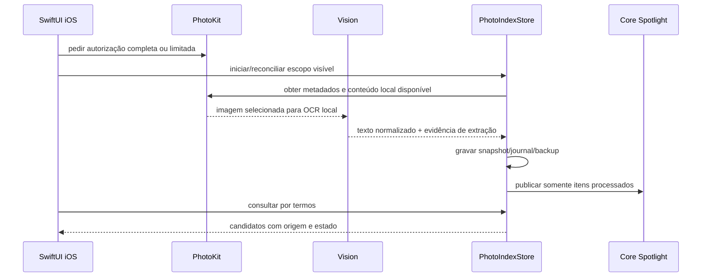

# Arquitetura do Pavlak

Este documento descreve o que existe no checkout atual. Ele não é uma promessa de arquitetura futura.

## Visão de componentes

| Área | Local principal | Responsabilidade |
| --- | --- | --- |
| App macOS | `Sources/Pavlek/PavlekApp.swift`, `ContentView.swift` | Janela SwiftUI, estado do workspace, navegação, conexões e ações explícitas. |
| Busca de arquivos | `FileIndexService.swift`, `FileIndexStore.swift`, `LocalUnifiedSearch.swift` | Bookmarks autorizados, indexação limitada, extração de conteúdo, ranking e prévia. |
| Busca de fotos macOS | `MacPhotoAlbumSearchService.swift`, `PhotoAlbumService.swift` | PhotoKit, álbuns, metadados e OCR local conforme a autorização atual. |
| Índice de fotos iOS | `PhotoIndexer.swift`, `PhotoIndexStore.swift`, `PhotoIndexModels.swift` | Snapshot persistente, migração, journal, backup, escopo limitado e estados de processamento. |
| Busca no dispositivo | `PhotoSpotlightIndex.swift`, `IOSContentView.swift` | Projeção Core Spotlight e consultas locais sobre o índice iOS. |
| Orquestração | `IntentParser.swift`, `PavlakWorkspaceState.swift`, `PavlakAgent.swift`, `OpenAIOrchestrator.swift` | Separa rotas locais, seleção, contexto, ferramentas e respostas remotas. |
| IA | `OpenAIResponsesClient.swift`, `AzureResponsesClient.swift`, `IOSChatClient.swift`, `PavlakAIConfiguration.swift` | Transporte Responses, configuração de OpenAI/Azure, estado de conversa e política de armazenamento por cliente. |
| Voz | `SpeechTranscriptionService.swift`, `AzureRealtimeVoiceService.swift` | Reconhecimento local e sessão de voz Azure opcional no macOS. |
| Link entre dispositivos | `PavlakLinkService.swift`, `PavlakLinkAuthentication.swift` | Bonjour, Network.framework, pareamento, TLS 1.3 PSK e mensagens autenticadas. |
| Ponte MCP | `Sources/PavlakMCPBridge/main.swift`, `PavlakMCPStatusStore.swift` | Consulta somente leitura do estado publicado no Application Support. |
| Pacote legado separado | `PavlakUnifiedCore/` | Núcleo Swift menor, com parser, ferramentas locais, Keychain e Responses; ainda não é a implementação única do app principal. |

## Fluxo de busca local

1. A interface recebe o pedido e o parser identifica fonte, tipo, termos, data e ação.
2. Antes de ler um arquivo, o usuário fornece uma pasta pelo seletor do sistema. O bookmark é salvo para uso posterior.
3. `FileIndexService` limita o escopo às raízes autorizadas e evita seguir links simbólicos para fora delas.
4. O motor extrai apenas os formatos suportados e produz registros com origem, conteúdo/OCR, metadados e data de modificação.
5. `LocalUnifiedSearch` ranqueia poucos candidatos e explica a correspondência. A ausência total só é afirmada quando as fontes elegíveis foram consultadas.
6. Selecionar um candidato não abre nem altera o arquivo. A abertura ou prévia revalida a autorização e a existência do caminho.

## Fluxo de fotos e índice iOS

O store não apaga originais do PhotoKit. Revogação remove dados derivados do Pavlak, e itens somente no iCloud permanecem explicitamente pendentes até uma ação individual que obtenha o conteúdo.

## Comunicação macOS–iOS

O serviço anuncia `_pavlak-link._tcp` via Bonjour e descobre o par na rede local. O segredo de pareamento é mantido no Keychain. A chave de transporte é derivada com HKDF-SHA256; o código fixa TLS 1.3 e as mensagens carregam autenticação, nonce e timestamp. O protocolo atual envia comandos/resultados estruturados, não um espelho geral da Fototeca.

A ligação é uma integração implementada, mas o handshake físico, a reconexão e a consulta real com dois dispositivos continuam aceitação manual. Os testes existentes cobrem derivação, assinatura, adulteração e expiração com fixtures.

## Política de IA

O caminho local deve resolver buscas especializadas antes da rede. Quando o modo remoto é permitido, a aplicação carrega a configuração do provedor e a credencial do Keychain, aplica limites locais e faz a chamada por `URLSession`. Os clientes atuais cobrem OpenAI Responses, Azure Responses e, no macOS, Azure Realtime.

O código de testes usa credenciais sintéticas e sessões mockadas. Nenhuma chave real é necessária para compilar. Uma resposta de API observada em outra execução não é tratada como prova de que um clone deste checkout tem cota, modelo ou crédito disponível.

## Persistência e privacidade

- configuração e credenciais ficam separadas;
- credenciais não devem chegar aos logs;
- o índice contém dados derivados e identificadores necessários para reabrir a fonte, não miniaturas persistidas por padrão;
- a abertura exige revalidação de autorização e geração/escopo quando aplicável;
- o transporte iOS é stateless para conversa e usa `store: false` nos corpos atuais;
- a ponte MCP publica um snapshot operacional em Application Support e não expõe uma operação de escrita.

## Limites arquiteturais atuais

- o pacote principal e `PavlakUnifiedCore` têm clientes, modelos e superfícies que se sobrepõem;
- macOS e iOS compartilham muitos fontes por condicionais de plataforma, o que torna um build Xcode distinto do `swift test` macOS;
- o registro de conectores inclui estados de disponibilidade, mas vários aplicativos são apenas pontos de abertura, não conectores de leitura;
- o ranking atual é textual/estrutural e explicável; não há evidência de ranking semântico superior em um benchmark controlado;
- os fluxos físicos de permissões, OCR, Spotlight, pareamento e iPhone permanecem distintos da cobertura unitária.

## Retenção por cliente

O cliente macOS `OpenAIResponsesClient` usa `store: true`, `/v1/conversations` e `previous_response_id`. Ao habilitar esse modo remoto, mensagens e saídas de ferramentas entram no estado remoto da conversa. Não há garantia geral de ausência de retenção remota. `AzureResponsesClient`, `IOSChatClient` e `PavlakUnifiedCore` usam `store: false` em seus corpos atuais. Isso descreve o pedido enviado; não equivale a uma política de retenção zero do provedor. A busca especializada em modo local continua separada desses caminhos.
