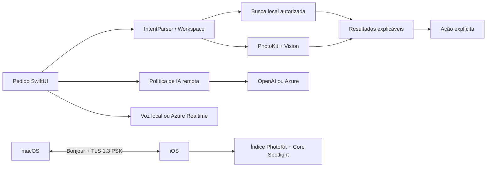

# Pavlak

Pavlak é um protótipo de recuperação documental e fotográfica local-first para macOS e iOS. Ele tenta transformar um pedido em linguagem natural em uma busca autorizada, pequena e explicável, preservando a fonte original e deixando a ação seguinte sob controle explícito da pessoa.

Este snapshot é um candidato público técnico publicado em um repositório Git com histórico novo. O código é real; a cadeia de autoria e os direitos de redistribuição de cada componente continuam sob responsabilidade do mantenedor.

## Por que o projeto existe

Documentos e fotos pessoais ficam espalhados entre pastas, Fototeca e dispositivos. O objetivo do Pavlak é reduzir o custo de localizar uma fonte específica sem transformar uma resposta provável em prova, sem pesquisar fora das áreas autorizadas e sem enviar conteúdo a um provedor remoto por padrão.

O fluxo de confiança pretendido é:

```text
pedido -> fonte autorizada -> candidatos limitados -> motivo da correspondência
       -> fonte exata -> ação explícita -> limite honesto quando faltar evidência
```

## Estado atual

| Estado | O que significa neste checkout |
| --- | --- |
| Implementado | Código e testes para busca local em pastas autorizadas, índice PhotoKit no iOS, OCR local, resultados explicáveis, políticas de credencial, ligação autenticada e ponte MCP somente leitura. |
| Em desenvolvimento | Integração coesa entre todos os fluxos de busca, aceitação manual com acervo sintético controlado, estabilização do alvo iOS e consolidação do pacote `PavlakUnifiedCore`. |
| Planejado | Relações documentais mais ricas, App Intents, ranking semântico medido, distribuição assinada e uma superfície pública de contribuição mais ampla. |

As categorias acima descrevem implementação no código, não disponibilidade comercial, validação em dispositivo, elegibilidade de programa ou adoção por usuários.

## O que já está implementado

- aplicativo SwiftUI macOS no produto `Pavlek`;
- alvo iOS `Pavlak Photo Search` no `PavlakIOS.xcodeproj`;
- `PavlakMCPBridge`, que expõe o estado operacional em modo somente leitura via JSON-RPC sobre stdin/stdout;
- busca local de arquivos em pastas escolhidas com bookmarks security-scoped, leitura limitada e prévia antes da abertura explícita;
- classificação e ranking local de tipos documentais, nome, conteúdo, OCR, metadados e data de modificação;
- índice iOS em `Application Support/Pavlak Photo Index/index-v1.json`, com diário pendente, backup, escopo de autorização e estados de processamento;
- PhotoKit, Vision/OCR e Core Spotlight no caminho iOS, respeitando autorização completa ou limitada;
- busca autorizada de fotos e álbuns no macOS, com OCR em memória e sem download automático de originais do iCloud;
- ligação macOS–iOS anunciada por Bonjour e transportada com Network.framework, TLS 1.3 PSK, HMAC, nonce, janela temporal e proteção contra replay;
- credenciais em Keychain, separadas da configuração; modo local bloqueia a rede antes de consultar a credencial;
- clientes para OpenAI Responses API e Azure OpenAI/Microsoft Foundry Responses; a retenção varia por cliente e está documentada em [SECURITY.md](SECURITY.md);
- voz local com `AVAudioEngine`/`SFSpeechRecognizer` e caminho de voz remota Azure Realtime no macOS;
- testes unitários para roteamento, busca, persistência, revogação, credenciais, política de uso remoto e mensagens entre dispositivos.

## O que não deve ser inferido

- passar em testes unitários não comprova a abertura do aplicativo, o fluxo visual ou a aceitação em iPhone;
- instalar ou iniciar um build não comprova uma busca documental real com dados pessoais;
- a presença de um cliente OpenAI/Azure não comprova credencial válida, cota, crédito, cobrança ou disponibilidade de deployment;
- OCR e correspondência textual são evidências de extração, não confirmação de titularidade ou de um fato jurídico;
- o suporte a um aplicativo no registro de conectores não significa que exista leitura ou escrita nesse aplicativo;
- os recursos planejados neste README não estão disponíveis só porque aparecem no roadmap.

## Arquitetura

Os componentes principais estão descritos em [ARCHITECTURE.md](ARCHITECTURE.md). Em resumo:



O diretório `PavlakUnifiedCore/` é um pacote Swift separado e historicamente reutilizável. Ele contém uma implementação menor de conversa, ferramentas locais e armazenamento de credencial; não é tratado como o runtime canônico do aplicativo principal até que a consolidação seja concluída.

## Requisitos

- macOS 14 ou posterior para o pacote principal;
- iOS 17 ou posterior para o alvo Xcode;
- Swift 6 para `Package.swift`;
- Xcode compatível com o SDK instalado para compilar e executar o alvo iOS;
- permissões do sistema concedidas pelo usuário para Fotos, microfone, reconhecimento de fala e rede local quando o fluxo correspondente for usado.

O uso de Foundation Models é opcional e condicionado à disponibilidade do sistema. O parser determinístico continua sendo o fallback para ambientes sem esse recurso.

## Build e execução

No macOS, a partir da raiz:

```sh
swift build
swift run Pavlek
```

Para o serviço de estado MCP:

```sh
swift build --product PavlakMCPBridge
```

No Xcode, abra `PavlakIOS.xcodeproj`, escolha o scheme `Pavlak Photo Search`, selecione um destino iOS e configure manualmente a equipe de assinatura no ambiente local. O identificador de equipe não é armazenado neste repositório público.

Os comandos acima compilam o código. Eles não concedem permissões, assinam o aplicativo, abrem o app nem validam um dispositivo físico automaticamente.

## Testes

```sh
swift test --disable-sandbox
(cd PavlakUnifiedCore && swift test --disable-sandbox)
xcodebuild -list -project PavlakIOS.xcodeproj
```

Na verificação de 14 de setembro de 2026 nesta cópia isolada, `swift build` e `swift test --disable-sandbox` passaram; a raiz executou 142 testes e `PavlakUnifiedCore` executou 10 testes, ambos sem falhas. `xcodebuild -list` enumerou o alvo iOS e um build Debug para iOS Simulator sem assinatura também passou. Isso não substitui aceitação em dispositivo físico, permissões do sistema ou validação de conta/provedor. O detalhe dos comandos e dos limites está em [docs/REPOSITORY_AUDIT.md](docs/REPOSITORY_AUDIT.md).

## Configuração e credenciais

Não há `.env` necessário para o caminho normal. Consulte [Support/CONFIGURATION.example.md](Support/CONFIGURATION.example.md). A configuração de provedor é feita na interface e as credenciais são guardadas no Keychain; nunca coloque chaves OpenAI, Azure, certificados, provisioning profiles ou códigos de pareamento em arquivos, issues ou logs.

O modo local é o padrão de segurança para buscas especializadas. Uma chamada remota exige configuração, consentimento e uma credencial armazenada no Keychain. Custos, limites, créditos e disponibilidade do provedor permanecem responsabilidades externas ao aplicativo.

## Privacidade e segurança

O Pavlak procura manter a busca de arquivos e fotos no dispositivo, lê somente fontes autorizadas e não modifica originais durante indexação. A ligação entre dispositivos exige pareamento. Os limites e riscos conhecidos estão em [SECURITY.md](SECURITY.md) e em [ARCHITECTURE.md](ARCHITECTURE.md).

Não use dados pessoais, jurídicos, financeiros ou fotos reais em exemplos, testes públicos ou issues. A preparação desta pasta encontrou material privado e o exclui do candidato por meio de `.gitignore`; os arquivos locais não foram apagados.

## Documentação

- [ARCHITECTURE.md](ARCHITECTURE.md) — componentes, fluxos e limites arquiteturais;
- [docs/CODEX_OPEN_SOURCE_FUND.md](docs/CODEX_OPEN_SOURCE_FUND.md) — evidências factuais para uma candidatura;
- [docs/REPOSITORY_AUDIT.md](docs/REPOSITORY_AUDIT.md) — auditoria de conteúdo público, comandos e pendências;
- [docs/SYNTHETIC_DEMO.md](docs/SYNTHETIC_DEMO.md) — roteiro funcional sem documentos pessoais ou credenciais;
- [CONTRIBUTING.md](CONTRIBUTING.md) — setup e regras para contribuições;
- [ROADMAP.md](ROADMAP.md) — milestones sem apresentar planejamento como entrega;
- [CHANGELOG.md](CHANGELOG.md) — mudanças deste candidato;
- [SECURITY.md](SECURITY.md) — credenciais, dados sensíveis e limites de segurança;
- [AGENTS.md](AGENTS.md) — invariantes de trabalho para agentes e mantenedores.

## Como contribuir

Comece por uma issue ou pelos templates em `.github/ISSUE_TEMPLATE/`. Contribuições devem trazer um caso reprodutível, testes quando aplicável e a distinção entre comportamento implementado, observação manual e hipótese. Mudanças em permissões, transporte, credenciais, indexação ou dados persistidos exigem revisão de segurança.

## Licença e publicação

O código deste candidato está sob [MPL-2.0](LICENSE), com avisos em [NOTICE](NOTICE). A cadeia de autoria e os direitos de redistribuição de cada componente devem ser mantidos pelo mantenedor. A licença do código não concede direitos sobre o nome, logotipos ou identidade visual Pavlak.

## Descrição curta para GitHub

**Pavlak — local-first document and photo retrieval for macOS and iOS, with authorized search, explainable evidence, privacy boundaries, and optional AI/device-link integrations.**
